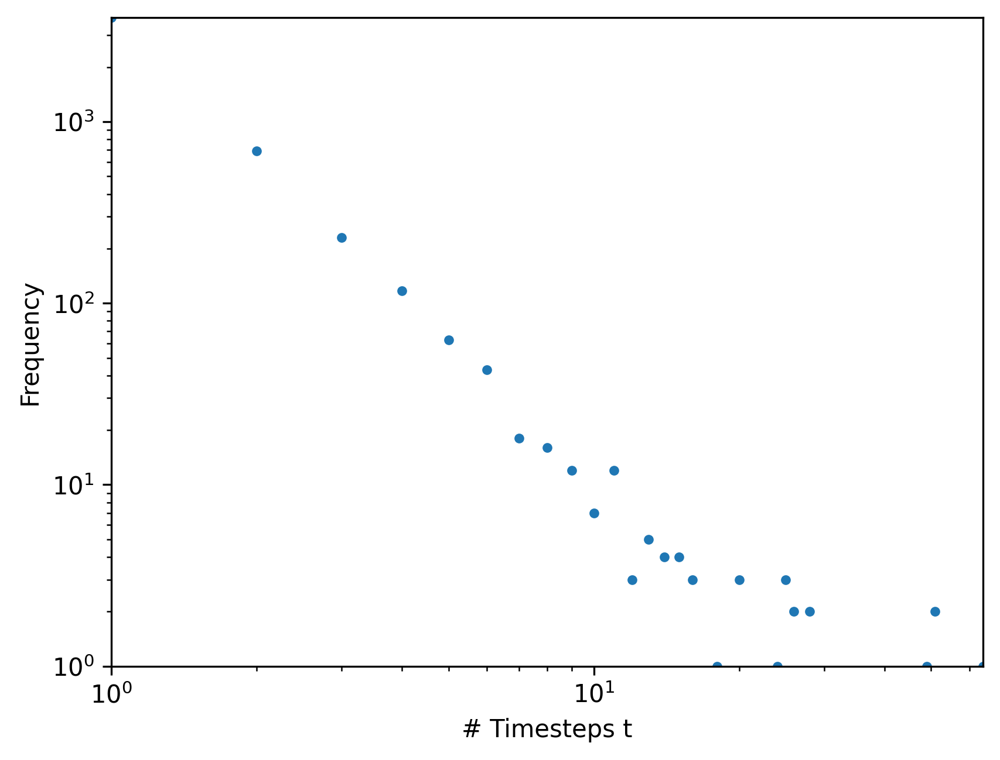
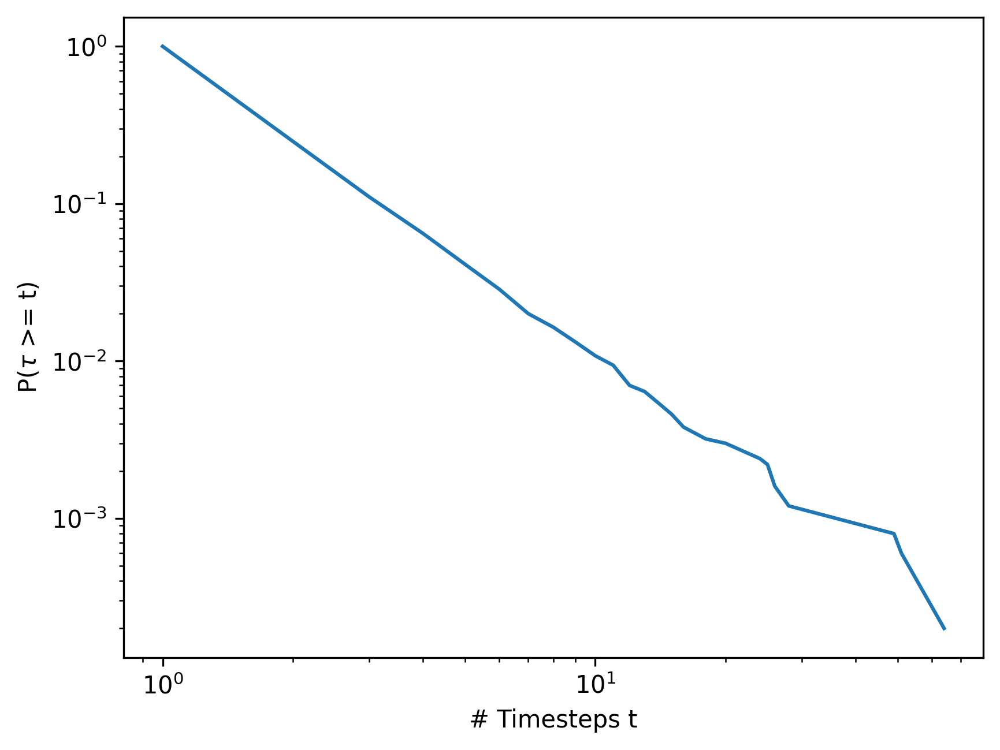

# rstan-discrete-powerlaw

Trying to replicate https://fabiandablander.com/r/Law-of-Practice.html with discrete data.

Synthetic data [synthetic_data_pl.csv](synthetic_data_pl.csv) is generated with [sim_pl.R](sim_pl.R) and exhibits power law with exponent $-2$.

